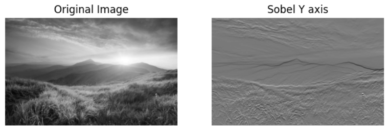

# EDGE-DETECTION
## Aim:
To perform edge detection using Sobel, Laplacian, and Canny edge detectors.

## Software Required:
Anaconda - Python 3.7

## Algorithm: 
### Step1:
Import all the necessary modules for the program.

### Step2:
Load a image using imread() from cv2 module.

### Step3:
Convert the image to grayscale

### Step4:
Using Sobel operator from cv2,detect the edges of the image.

### Step5:

Using Laplacian operator from cv2,detect the edges of the image and Using Canny operator from cv2,detect the edges of the image.

## Program:
### Developed by:Shaik Shoaib Nawaz
### Register Number:212222240094
1.) SOBEL EDGE DETECTOR
```
import matplotlib.pyplot as plt

# Read the image using imread
img = cv2.imread('nature.jpg')  # Replace 'image_path.jpg' with the actual path to your image

# Convert the color to grayscale
gray = cv2.cvtColor(img, cv2.COLOR_BGR2GRAY)
gray = cv2.GaussianBlur(gray, (3, 3), 0)

# Sobel X axis
sobelx = cv2.Sobel(gray, cv2.CV_64F, 1, 0, ksize=5)
plt.figure(figsize=(8, 8))
plt.subplot(1, 2, 1)
plt.imshow(gray, cmap='gray')
plt.title("Original Image")
plt.axis("off")
plt.subplot(1, 2, 2)
plt.imshow(sobelx, cmap='gray')
plt.title("Sobel X axis")
plt.axis("off")
plt.show()

# Sobel Y axis
sobely = cv2.Sobel(gray, cv2.CV_64F, 0, 1, ksize=5)
plt.figure(figsize=(8, 8))
plt.subplot(1, 2, 1)
plt.imshow(gray, cmap='gray')
plt.title("Original Image")
plt.axis("off")
plt.subplot(1, 2, 2)
plt.imshow(sobely, cmap='gray')
plt.title("Sobel Y axis")
plt.axis("off")
plt.show()

# Sobel XY axis
sobelxy = cv2.Sobel(gray, cv2.CV_64F, 1, 1, ksize=5)
plt.figure(figsize=(8, 8))
plt.subplot(1, 2, 1)
plt.imshow(gray, cmap='gray')
plt.title("Original Image")
plt.axis("off")
plt.subplot(1, 2, 2)
plt.imshow(sobelxy, cmap='gray')
plt.title("Sobel XY axis")
plt.axis("off")
plt.show()
```
2.) LAPLACIAN EDGE DETECTOR
```
# Laplacian Edge Detector
lap = cv2.Laplacian(gray, cv2.CV_64F)
plt.figure(figsize=(8, 8))
plt.subplot(1, 2, 1)
plt.imshow(gray, cmap='gray')
plt.title("Original Image")
plt.axis("off")
plt.subplot(1, 2, 2)
plt.imshow(lap, cmap='gray')
plt.title("Laplacian Edge Detector")
plt.axis("off")
plt.show()
```
3.) CANNY EDGE DETECTOR
```
# Canny Edge Detector
canny = cv2.Canny(gray, 120, 150)
plt.figure(figsize=(8, 8))
plt.subplot(1, 2, 1)
plt.imshow(gray, cmap='gray')
plt.title("Original Image")
plt.axis("off")
plt.subplot(1, 2, 2)
plt.imshow(canny, cmap='gray')
plt.title("Canny Edge Detector")
plt.axis("off")
plt.show()
```
## Output:
### SOBEL EDGE DETECTOR
i.) Sobel X axis:


ii.) Sobel Y axis:


iii.) Sobel XY axis:


### LAPLACIAN EDGE DETECTOR


### CANNY EDGE DETECTOR

## Result:
Thus the edges are detected and executed using Sobel, Laplacian, and Canny edge detectors successfully.